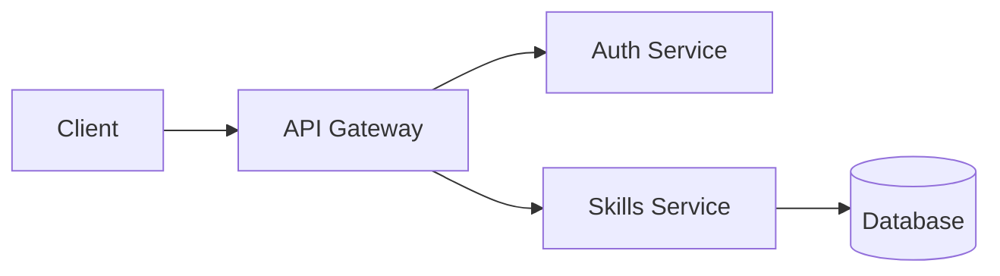

# Technical Analytical Writing

Communicate complex technical ideas clearly through structured analysis and evidence-based reasoning.

## Document Types

### Architecture Decision Record (ADR)

```markdown
# ADR-{NNN}: {Decision Title}

**Status:** Proposed | Accepted | Deprecated | Superseded by ADR-{NNN}
**Date:** YYYY-MM-DD
**Deciders:** {names/roles}

## Context

What is the issue that motivates this decision? What forces are at play?

## Decision

What is the change being proposed or decided?

## Consequences

### Positive
- {benefit}

### Negative
- {tradeoff}

### Neutral
- {observation}

## Alternatives Considered

### {Alternative A}
- Pros: {list}
- Cons: {list}
- Why rejected: {reason}
```

### System Analysis Document

```markdown
# {System/Component} Analysis

## Executive Summary
{2-3 sentences: what, why, recommendation}

## Current State
{What exists today, with evidence}

## Problem Statement
{Specific, measurable issue being addressed}

## Analysis
{Evidence-based investigation}

## Recommendations
{Ordered by priority, with effort estimates}

## Appendix
{Raw data, detailed metrics, supplementary evidence}
```

### Technical RFC

```markdown
# RFC: {Title}

**Author:** {name}
**Status:** Draft | Review | Accepted | Rejected
**Created:** YYYY-MM-DD
**Review deadline:** YYYY-MM-DD

## Summary
{One paragraph: what this proposes}

## Motivation
{Why this is needed, with concrete examples}

## Detailed Design
{How it works, with diagrams and code examples}

## Drawbacks
{Honest assessment of downsides}

## Alternatives
{What else was considered and why this approach wins}

## Unresolved Questions
{Open items for discussion}
```

## Writing Principles

### Argument Structure

Every analytical section follows:

1. **Claim** — What you're asserting
2. **Evidence** — Data, metrics, code examples supporting the claim
3. **Reasoning** — Why the evidence supports the claim
4. **Implication** — What follows from this being true

### Evidence Hierarchy

| Strength | Evidence Type | Example |
|----------|--------------|---------|
| Strongest | Production metrics | "P99 latency increased 3x after migration" |
| Strong | Reproducible test | "Benchmark shows 40ms vs 120ms" |
| Moderate | Code analysis | "This pattern creates N+1 queries" |
| Weak | Expert opinion | "The team believes this will scale" |
| Weakest | Analogy | "Netflix does it this way" |

### The Pyramid Principle

Lead with the conclusion, then support:

**Bad:**
> We analyzed the database, then the cache layer, then the API, and found that response times are slow because the cache hit rate is only 23%.

**Good:**
> Cache hit rate is 23%, causing slow response times. The database query layer generates cache keys inconsistently, leading to unnecessary misses. Standardizing key generation would bring hit rate to ~85%.

## Structural Patterns

### Problem-Solution-Evidence

```markdown
## {Problem Name}

**Problem:** {specific, measurable issue}

**Solution:** {proposed change}

**Evidence:** {why this solution addresses the problem}

**Effort:** {T-shirt size + key dependencies}
```

### Compare-Contrast Table

```markdown
| Criterion | Option A | Option B | Option C |
|-----------|----------|----------|----------|
| Performance | ★★★ | ★★ | ★★★ |
| Complexity | Low | Medium | High |
| Team familiarity | High | Low | Medium |
| Maintenance cost | Low | High | Medium |
| **Recommendation** | **✓** | | |
```

### Risk Matrix

```markdown
| Risk | Likelihood | Impact | Mitigation |
|------|-----------|--------|------------|
| API rate limiting | High | Medium | Client-side rate limiter + cache |
| Data migration failure | Low | Critical | Rollback plan + dry-run first |
| Team bandwidth | Medium | High | Phased rollout |
```

## Style Guidelines

### Clarity

- **Active voice:** "The scheduler triggers the job" not "The job is triggered by the scheduler"
- **Concrete nouns:** "The API returns a 429 status" not "There are issues with the API"
- **Specific numbers:** "P99 latency is 230ms" not "Latency is high"

### Conciseness

- Lead with the point, not the preamble
- One idea per paragraph
- Cut "In order to" → "To"
- Cut "It is important to note that" → (just state it)
- Cut "As mentioned previously" → (don't mention it)

### Technical Accuracy

- Verify all metrics and measurements
- Include measurement methodology
- Distinguish between observations and interpretations
- Cite sources for external claims
- Date all data ("as of March 2026")

## Diagrams

### When to Use Diagrams

| Situation | Diagram Type |
|-----------|-------------|
| System components | Architecture diagram (boxes + arrows) |
| Process flow | Flowchart or sequence diagram |
| Data relationships | ER diagram |
| Timeline | Gantt or timeline |
| Hierarchy | Tree diagram |
| Comparison | Table (not a diagram) |

### Mermaid for Inline Diagrams

````markdown

````

## Review Checklist

- [ ] Executive summary is self-contained (reader gets the point without reading further)
- [ ] Every claim has supporting evidence
- [ ] Alternatives are fairly presented (not strawmen)
- [ ] Risks and tradeoffs acknowledged honestly
- [ ] Audience-appropriate level of detail
- [ ] Diagrams have legends and labels
- [ ] All acronyms defined on first use
- [ ] Stranger test: a new team member can follow the argument

## Anti-Patterns

- **Burying the lead** — Put conclusions first, evidence after
- **Appeal to authority** — "Google does it" is not an argument; explain why it works
- **False precision** — "This will improve performance by 47.3%" without measurement methodology
- **Missing alternatives** — Always compare at least 2-3 options
- **Scope creep** — Stay focused on the stated question; flag tangents for separate docs
- **No expiration date** — All analysis should include "valid as of" and conditions for revisiting
